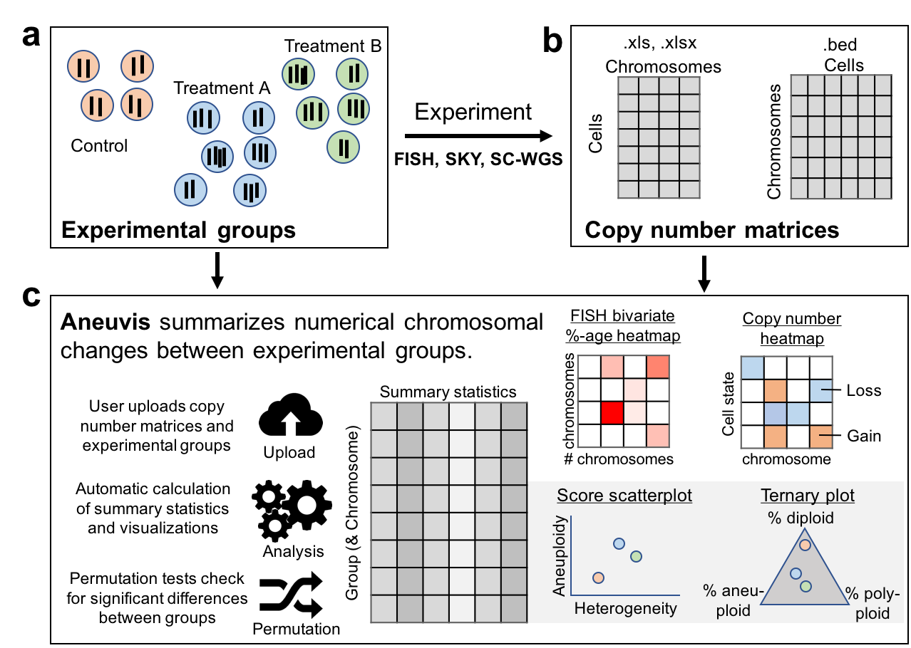

## README

*Aneuvis* is a web-based tool to automatically analyze numerical chromosomal variation in single cells.

Aneuvis is available at [dpique.shinyapps.io/aneuvis/](https://dpique.shinyapps.io/aneuvis/)
